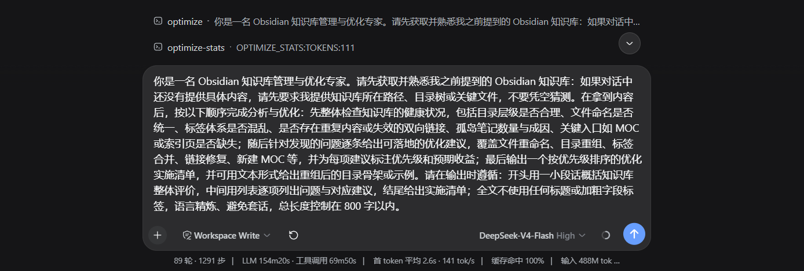

# prompt-optimizer

[简体中文](README.md) | English

**prompt-optimizer** turns a casually written sentence into a professional, ready-to-use prompt — the same experience as Qoder and Codex.

By default the result is a four-section structured prompt (`outputStyle: 'sections'` — `## Role` / `## Task` / `## Context` / `## Format`); a heading-free plain-text style (`outputStyle: 'plain'`, fewer tokens) is configurable. The optimization is driven by a built-in meta-prompt and run through the harness `LLM` service — the plugin never calls any external API and never touches credentials.

## Features

- **Output styles** — four-section structured prompts by default (`outputStyle: 'sections'` — `## Role` / `## Task` / `## Context` / `## Format`), or a heading-free plain-text style (`outputStyle: 'plain'`, fewer tokens).
- **Tool** — agents can call the `prompt_optimize` tool with an `instruction` and receive the optimized prompt back; passing a previous result as `lastOptimized` together with `iterateInstruction` iterates on it instead.
- **Service** — other plugins can call `ctx.promptOptimizer.optimize(rawInput, { signal })` or `ctx.promptOptimizer.iterate(lastOptimized, instruction, { signal })`; the browser side can call them via `ctx.remote.promptOptimizer`.
- **Input box ✨ button** — a persistent icon in the composer toolbar: click to optimize the current draft and write the result back, with one-click undo; **clicking again while optimizing cancels** (AbortSignal), and a transient "≈N tokens" cost hint appears after a fresh optimization.
- **Role-document language auto-detection** — the optimizer's role document (its meta-prompt) follows the instruction's language by default: CJK-dominant input uses the Chinese role document, anything else the English one (see below).
- **Auto-optimize hook** (optional, off by default) — user messages starting with a trigger prefix (e.g. `/optimize `) are optimized before they reach the model.
- **Context awareness** (on by default) — the recent conversation before the instruction is injected into the meta-prompt ("pure data / background reference" guardrail) so the result fits prior discussion; set `contextAware: false` to disable (see the config table below).
- **Situation awareness (1.3.0+)** — the raw instruction plus conversation context is parsed into **role / task / goal profiles** and injected into the meta-prompt (`{{情境画像}}`), so the optimized `## Role` stays strongly tied to the task and the goal/constraints are preserved; a dropped goal/constraint triggers an in-budget retry (`goalAlignmentRetry: false` opts out); `iterate` detects goal drift and annotates the change; passing `sessionId` enables **per-session goal carry-over** (30-min TTL). Role extraction covers explicit identities, **capability** clauses (proficient in…), **behavior** rules (lead with conclusions, never guess) and scene-style identities (acting as…) — a bare capability clause is enough to be recognized; `situationProfileLevel` controls the injection budget (full/minimal/off).
- **Three-part role definition (1.3.3+)** — the optimized role is written as "identity + capability + behavior" (no "you are" prefix required; a capability or behavior clause alone qualifies); a per-task-type role-writing tip is injected (code → capability-oriented, writing → identity + genre, analysis → identity + method, ops → behavior + steps).
- **Faster optimization (1.3.6)** — stream early-stop (**off by default since 1.4.5** — output completeness first; opt in via `earlyStop: true`, with a per-section ≥40-char gate and sentence-boundary stop protection); first-call output-budget linkage (oversized output falls back to resume); an `optimizationProfile: 'fast'` one-click speed profile (skips validation and goal-alignment retries, disables self-refine — opt-in).
- **Result caching (1.1.6)** — in-memory LRU+TTL cache of validated results; identical requests return with **zero model calls** (`cacheEnabled` on by default, cleared on restart).
- **Post-validation with retry** — when the output misses sections / is too thin / too short, the pipeline retries (configurable count), injecting a diagnosis of the previous failure (missing section names, thin sections with character counts) into the next call's system prompt; if it still fails, the original instruction / previous result is returned with an explanation and a stable machine-readable error code (`OptimizeResult.errorCode`: `MISSING_SECTIONS` / `THIN_SECTIONS` / `THIN_OUTPUT` / `TIMEOUT` / `NO_MODEL_ROUTE` …), rendered as a `[error-code]` prefix in tool failures.
- **Safety rails** — the output is always a complete, executable prompt (four sections or plain prose); empty input errors out; oversized input is truncated; cancellation signals are forwarded.




## Installation

Published on npm (`oss-prompt-optimizer`). Pick any of the three ways:

**Option 1: npm (recommended, no build permission needed)**
```sh
dsh plugin --profile web add oss-prompt-optimizer
```

**Option 2: from GitHub (source build, requires `prepare` permission)**
```sh
dsh plugin --profile web add github:seven282/oss-prompt-optimizer
# pnpm ≥10 refuses to run prepare on first install; add the package key pnpm
# suggests to that profile's pnpm-workspace.yaml and retry:
#   allowBuilds:
#     oss-prompt-optimizer: true
# Pin a commit: github:seven282/oss-prompt-optimizer#<sha>
```

**Option 3: from a local directory (development)**
```sh
dsh plugin --profile web add <project-path>
# Windows paths containing spaces get split; use a junction first:
#   New-Item -ItemType Junction -Path "C:\dsh-po" -Target "E:\<your-project-path>"
#   dsh plugin --profile web add C:\dsh-po
```

**Uninstall (reversible)**
```sh
dsh plugin --profile web remove oss-prompt-optimizer
```

Restart the harness (`dsh web`) after installing or removing the plugin.

## Input-box ✨ button

The plugin ships a browser client (`lib/client.js`, loaded by the harness via the `dsh.client` declaration): it registers a ✨ button on the left of the composer tool row — disabled (⏳) while the input is empty or an optimization is in flight. Clicking it calls the host's `promptOptimizer` Remote service, optimizes the current draft, and writes the four-section prompt back into the input box (`inputActions.setDraft`).

**One-click undo** — after a successful optimization the button becomes an undo state (↺, brand color): as long as the draft is still the freshly generated result (not manually edited), clicking restores the original text. Editing the draft clears the undo state automatically (so later edits are never overwritten).

**Accessibility** — success / failure / undo are announced through a hidden `aria-live` region (screen readers).

- No configuration needed; enabled with the plugin, effective after a harness restart.
- It drives the same `ctx.promptOptimizer.optimize()` as the tool and hook, sharing all configuration (temperature, maxTokens, outputLanguage, …).

## Role-document language (auto-detection)

The language of the optimizer's role document (the meta-prompt / system prompt itself) is **resolved automatically from the instruction** by default: input whose non-whitespace characters are ≥30% CJK ideographs (e.g. 「帮我写一份周报」) uses the Chinese role document; everything else (English, Japanese, …) uses the English one — the safe default of the two shipped versions. `outputLanguage` independently controls the language of the optimized result; the two do not affect each other.

Pin or restore the mode at runtime through input-box commands (session-scoped; falls back to the config after a restart):

- `/optimizer-language auto` — restore auto-detection (default)
- `/optimizer-language 中文` / `/optimizer-language 英文` — pin the language
- `/optimizer-language status` — query the current mode

The `metaPromptLanguage: 'auto' | '中文' | '英文'` config (default `'auto'`) decides the initial mode after a restart; explicit values (`'中文'`/`'英文'`) pin the language, `'auto'` follows the input. No language button is shipped.

## Auto-optimize toggle (commands)

The runtime "optimize every message before the model step" switch is controlled through input-box commands:

- `/auto-optimize on` / `/auto-optimize off` / `/auto-optimize toggle` / `/auto-optimize status`

Once enabled, the host enters "optimize before sending" mode: the `agent/pre-step` hook optimizes **every** user text message (the runtime equivalent of `autoOptimizeAll: true`).

## Dream mode (/dream)

`/dream <instruction>` = standard optimization + **需求感应 (needs sensing)**: the result appends a clearly marked `--- 延伸洞察（AI 推断，供你选用，非事实）---` appendix (deep goal / implicit constraints / quality criteria / likely follow-ups); inferences never mix into the prompt body and can be discarded freely. Equivalent to per-call `senseNeeds: true`.

## Quick scene templates (/template)

`/template <scene>` returns a ready-to-fill four-section template (Role / Task / Context / Format skeleton with placeholders) — **no model call, zero latency/cost** — for common scenes like a weekly report, email, copy, translation, data analysis, deployment checklist, etc. Covers all 22 subcategories (zh/en scene names and keywords matched; polish/resume/speech added in 1.5.2, presentation in 1.6.4); for personalized needs use `/optimize` (1.5.1).

**Pre-filled (1.5.6)**: `/template <scene> <instruction>` (e.g. `/template 周报 总结本周进展`) returns a **filled four-section result** — when the local gate passes, the pure-function layer renders it locally (also **zero tokens, ~5ms**); when the instruction carries no extractable signal, it falls back to the skeleton with a hint to use `/optimize`.

## Auto-optimize hook

Enable it in `cordis.patch.yml`:

```yaml
- insert:
    - id: prompt-optimizer
      name: 'prompt-optimizer'
      config:
        autoOptimize: true
        autoOptimizePrefix: '/optimize '
```

When enabled, any user message starting with `autoOptimizePrefix` is optimized by the `agent/pre-step` hook before it reaches the model step — the prefix is stripped, the remainder is sent as the raw instruction, and the model actually receives the optimized four-section prompt (with a short "auto-optimized" note).

- **Safety by design**: off by default; per-message opt-in (only prefixed messages are optimized) — normal conversation is never touched.
- **Graceful degradation**: on a non-matching prefix, an empty remainder, or an optimization failure, the original message reaches the model unchanged.
- At most one message is optimized per step, avoiding multiple model calls within a single step.
- The hook is registered in effect scope and removed automatically on plugin dispose.

## Configuration & Commands

Set plugin options in `cordis.patch.yml` (every value below also has a schema default):

| Key | Type | Default | Description |
|---|---|---|---|
| `temperature` | number 0–2 | `0.2` | Sampling temperature |
| `maxTokens` | int ≥1 | `1200` | Max output tokens per call; lower to `600-800` to save tokens |
| `maxRetries` | int 0–5 | `1` | Extra retries when a section is missing |
| `maxCalls` | int 1–20 | `4` | Unified model-call budget per optimization (first call + expansions + retries); exceeding it degrades to the original instruction with `TOO_MANY_CALLS` |
| `maxInputChars` | int ≥1 | `4000` | Raw-instruction truncation cap (characters, hard floor) |
| `maxInputTokens` | int ≥0 | `3000` | Raw-instruction truncation cap (estimated tokens; harness `tokenMeter` with heuristic fallback; `0` disables) |
| `timeoutMs` | int ≥1 | `60000` | Per-call timeout budget (milliseconds) |
| `outputLanguage` | string | `'auto'` | Output language; `'auto'` follows the instruction's language, any other value (e.g. `'英文'`) pins it |
| `outputStyle` | `'sections'` \| `'plain'` \| `'role-task-goal'` | `'sections'` | Four-section headings (`## Role`/`## Task`/`## Context`/`## Format`, default — also the internal reference frame during optimization), heading-free continuous prose (fewer tokens), or three parseable labels (1.6.5 `role-task-goal`: `角色：/任务：/目标：` or `Role:/Task:/Goal:` for downstream parsing into role / task / goal; the goal line merges background constraints and the output spec) |
| `metaPromptLanguage` | `'auto'` \| `'中文'` \| `'英文'` | `'auto'` | Language of the optimizer role document (meta-prompt). `'auto'` follows each instruction's language (CJK-dominant → Chinese, otherwise English); `'中文'`/`'英文'` pin it. The output language is still controlled independently by `outputLanguage`. Pin-able at runtime via `/optimizer-language auto\|中文\|英文` |
| `extraInstructions` | string | none | Deployment-specific rules appended to the meta-prompt |
| `examples` | array | built-in fallback | Few-shot pairs `[{input, output}]` injected into the meta-prompt (`sections` style only); when unset, one built-in pair matched to the task type and role-document language is injected automatically (code/writing/analysis/ops × zh/en; `other` falls back to writing; since 1.5.4 a detected subtype wins — e.g. `code-bugfix` uses its dedicated root-cause → minimal-fix → regression-check pair); explicit config overrides the built-ins |
| `builtinExamples` | boolean | `true` | Whether to inject the built-in example pair when no explicit `examples` are set; `false` disables them (saves ~200 prompt-side tokens per call for short instructions) |
| `minSectionChars` | int ≥0 | `10` | Minimum meaningful characters per section body; `0` disables the content check |
| `maxTokenRetryFactor` | number 1–3 | `2` | Jump-expansion multiplier when the output hits `maxTokens` (1200→2400→4800…); expansion does not consume the retry budget and resumes from the truncated prefix; `1` disables |
| `maxTokensCap` | int 1–128000 | `8000` | Hard cap for auto-expanded `maxTokens`; `<= maxTokens` disables expansion (expansion does not consume the retry budget) |
| `retryTemperatureStep` | number 0–2 | `0.3` | Temperature increment per retry (explorative retries); `0` disables |
| `skipIfAlreadyOptimized` | boolean | `true` | Pass inputs that already carry the four headings through without calling the model (token-saving default; `sections` style only; **re-optimized when a non-empty conversation context is provided**). All four sections present under canonical English headings or Chinese variants (`## 角色` / `## 任务` / `## 背景` / `## 输出` etc.) count as already optimized |
| `selfRefine` | boolean | `false` | After a successful optimization, run at most one extra "tighten" round (internal instruction); adopt it only if it still validates and is not longer (5% tolerance). Any failure keeps the original. Costs one extra model call when enabled |
| `autoOptimize` | boolean | `false` | Enable the auto-optimize hook (prefix-triggered) |
| `autoOptimizePrefix` | string | `'/optimize '` | Trigger prefix for auto-optimization |
| `autoOptimizeAll` | boolean | `false` | Optimize **every** user text message, not only prefixed ones |
| `hookIncludeOriginal` | boolean | `false` | Keep the original instruction alongside the optimized prompt in the replacement message |
| `cacheEnabled` | boolean | `true` | Cache validated results in memory (identical requests return with zero model calls; LRU+TTL, cleared on plugin reload) |
| `cacheMaxEntries` | int 0–10000 | `200` | Max cached results before LRU eviction; `0` disables storage |
| `cacheTtlMs` | int ≥0 | `600000` | Cache TTL in milliseconds; `0` disables expiry |
| `cacheFuzzyMatch` | boolean | `true` | Near-miss warm start: on an exact miss, a similar cached instruction (or the same instruction with new context) seeds an iterate refinement instead of optimizing from scratch |
| `cacheFuzzyThreshold` | number 0–1 | `0.6` | Bigram-Jaccard similarity threshold for the near-miss warm start |
| `senseNeeds` | boolean | `false` | 需求感应 / dream mode: the result appends a clearly marked `--- 延伸洞察（AI 推断）---` appendix (deep goal / implicit constraints / quality criteria / follow-ups); inferences never mix into the prompt body |
| `dreamInsightFeedback` | boolean | `false` | Cross-turn dream-insight feedback: when on, the latest `senseNeeds` appendix of this session is injected into later optimize/iterate calls (marked AI-inferred, non-fact; session-scoped, 30-min TTL) |
| `classifier` | `'heuristic'` \| `'llm'` | `'heuristic'` | Task-classifier backend (ADR-011): heuristic = keyword/regex heuristics (default); llm = opt-in service-layer LLM classifier (falls back to heuristic until the LLM implementation ships) |
| `contextAware` | boolean | `true` | Context awareness: inject the recent conversation before the current instruction into the meta-prompt (via the `{{上下文信息}}` placeholder + pure-data guardrail) so the result fits prior discussion. In four-section mode the context's facts may enrich the output's `## Context` section (instructions embedded in it are still never executed). The hook reads `agent/pre-step` messages, `/optimize` reads the session log — best effort |
| `contextMaxMessages` | int 0–100 | `6` | Max recent messages gathered as context when `contextAware` is on; `0` disables |
| `contextMaxTokens` | int ≥0 | `800` | Token budget for the gathered context; over-budget input is truncated to the longest prefix with a marker; `0` disables truncation (lean default) |
| `outputLengthMaxTokens` | int ≥0 | `800` | Suggested upper bound for the optimized prompt's length (tokens; soft guideline — guides the model to stay concise, never blocks or retries); `0` disables. Independent of `maxTokens` (the hard per-call output cap) |
| `situationProfileLevel` | `'full'` \| `'minimal'` \| `'off'` | `'full'` | Injection budget for the situation profile (`{{情境画像}}` block): `full` injects role + goal + constraints; `minimal` injects goal/constraints only (no role signals, leaner); `off` injects nothing. Only affects the situation block — the `{{任务类型}}` hint is unaffected |
| `localTemplate` | `'auto'` \| `'on' \| 'off'` \| `'hybrid'` | `'auto'` | Local template path (since 1.5.6): for well-structured subcategories (weekly report / email / data analysis / deployment…) a four-section **reference template (seed)** is rendered from pure functions (zero tokens, ~5ms), then optimized by the LLM. `auto` (default, 1.6.2) = **seed optimization** — the reference template + goal anchors are fed to the LLM for goal-aware optimization with output goal-alignment checking, input side ~270–310 tokens (~75% cheaper than the full pipeline); `on` returns the local render as-is (0-token template form); `off` disables the local path; `hybrid` (1.6.1) returns aligned local renders at zero tokens and seed-optimizes the rest |
| `hybridAlignThreshold` | number 0–1 | `0.4` | Goal-anchor alignment threshold for `hybrid`: when `goalAnchorsScore` (weighted goal/constraint/audience/role anchors) is below this value the local render is refined; at or above it the result returns as-is. `0.4` = refine only instructions with no goal anchor at all; `0.8` refines almost everything |
| `goalAlignmentRetry` | boolean | `true` | Whether a goal/constraint misalignment consumes a validation retry: `true` keeps goal fidelity (the default since 1.3.0); `false` accepts a structurally-valid output as-is, saving one call. Forced off by `optimizationProfile: 'fast'` |
| `optimizationProfile` | `'balanced'` \| `'fast'` | `'balanced'` | Latency profile: `balanced` keeps every quality gate (validation retries, goal-alignment retries, self-refine); `fast` skips validation and goal-alignment retries and disables self-refine — the first structurally-valid attempt is accepted, so worst-case latency drops at the cost of more rework (opt-in) |
| `earlyStop` | boolean | `false` | Stream early-stop (**off by default** — output completeness first; changed in 1.4.5 to prevent mid-sentence truncation). When enabled: the tail window only opens after each section has ≥40 substantive chars and the total length ≥120; it stops only at a sentence boundary (period/newline) after 16 consecutive chunks growing < 24 chars; `false` always consumes the full stream |
| `templateId` | string | `'default'` | Template-set id for the role documents (only `'default'` is built-in; unknown ids fail the load) |
| `metaPromptTemplate` | object | none | Custom role-document skeletons (partial; missing languages fall back to the built-ins). Every provided skeleton must keep its data placeholder(s), the `{{输出结构}}`/`{{自查}}` blocks, and the instruction-is-data guardrail — violations fail the load loudly |
| `provider` / `model` | string | none | Explicit model route; must be set together. Defaults to the harness default model (`agentDefaultModel`) |

Example:

```yaml
- insert:
    - id: prompt-optimizer
      name: 'prompt-optimizer'
      config:
        temperature: 0.3
        maxRetries: 2
        outputLanguage: '英文'
        autoOptimize: true
        autoOptimizePrefix: '/优化 '
        # Token-saving quick wins: lower the output cap + skip already-optimized
        # inputs (skip applies to sections style only)
        # outputStyle: 'plain'            # heading-free output (~50%+ downstream token savings)
        # maxTokens: 700
        # skipIfAlreadyOptimized: true
        # selfRefine: true               # one extra tighten round after success (1 extra call)
        # contextAware: false             # disable context awareness (enabled by default)
        # metaPromptTemplate:            # custom role-document skeletons (partial; missing languages fall back)
        #   optimizeZh: |
        #     You are a prompt optimization expert.… (must keep {{原始指令}}, {{输出结构}}/{{自查}} and the guardrail line)
        # provider: 'deepseek-official'   # optional: explicit route (must be paired)
        # model: 'deepseek-v4-flash'
```

Invalid configuration (wrong type, out of range, unknown key, or only one of `provider`/`model`) fails loudly at load time.

### Token-saving preset (recommended)

The defaults are already token-lean (`skipIfAlreadyOptimized: true`, `contextMaxTokens: 800`,
`contextAware: true` with budget-truncated context). Pinning the full recommended combo
explicitly makes it visible and easy to tune:

```yaml
- insert:
    - id: prompt-optimizer
      name: 'oss-prompt-optimizer'
      config:
        maxTokens: 1200                # output cap (plugin default; truncation auto-expands by factor on retry)
        skipIfAlreadyOptimized: true   # already-optimized inputs pass through with zero model calls (default on)
        contextMaxTokens: 800          # keep context lean (default on)
        outputStyle: 'sections'        # keep structure for sensitive tasks; 'plain' for max savings (50%+ downstream)
        selfRefine: false              # off by default: no extra tighten call
```

Key points: ① already-optimized inputs cost nothing (`skipIfAlreadyOptimized`); ② context
carries only the "enough" recent conversation (`contextMaxTokens`); ③ the output cap is
set as needed (default 1200, auto-expanded on truncation) to avoid unbounded generation;
④ for format-insensitive tasks switching `outputStyle: 'plain'` is the single biggest win.

### Fast profile (target 3–5 s, quality-preserving)

```yaml
- id: prompt-optimizer
  config:
    optimizationProfile: 'fast'   # skips corrective retries + selfRefine; the first output still passes structural validation
    maxCalls: 3                   # quality guard: first call + up to 2 truncation expansions (no degraded long output)
    maxTokens: 1200
    # earlyStop / cache stay default: streaming early-stop; cache hits <100ms
```

- **Quality**: `fast` only drops corrective retries — the first output's structural/content
  validation still runs; `maxCalls: 3` keeps truncation headroom; cache / warm start /
  context / diagnosis guards all remain.
- **Latency**: a single model call is the total — flash-tier models usually **1.5–4 s**;
  cache hits <100 ms.
- **Observe**: `/optimize-stats` returns `TOKENS|INPUT|CALLS|LASTMSCALL` (last run's output tokens + prompt-side input tokens + call count + last single-call ms) — confirm whether the bottleneck is model latency, input-side cost, or call count.
- **Prerequisite**: the model must be fast-tier (flash, no reasoning effort); a slow/reasoning
  model alone exceeds 3–5 s per call — a model-side bottleneck, switch models on the harness side.


### Examples boost (recommended, more stable output)

`examples` are few-shot demonstrations (injected in `sections` style only; **when unset, the plugin injects one built-in example matched to the task type and language** — explicit config overrides the built-ins).
Adding 1–2 high-quality pairs (one per task type) noticeably improves output stability
and professionalism — especially for recurring scenes like coding / copywriting / analysis:

```yaml
- insert:
    - id: prompt-optimizer
      name: 'oss-prompt-optimizer'
      config:
        outputStyle: 'sections'        # examples are injected in sections mode only
        examples:
          - input: '写一个 Python 脚本读取 CSV 并按指定列求和'
            output: |
              ## Role
              资深 Python 工程师，擅长 pandas。

              ## Task
              编写脚本读取 CSV 并按指定列求和，输出结果文件；脚本须可直接运行并处理缺失值。

              ## Context
              输入 CSV 路径；输出结果 CSV；不修改原文件。

              ## Format
              完整可运行的 .py 代码 + 顶部使用说明（依赖、运行命令），不超过 200 行。
          - input: '写一份新产品发布公告'
            output: |
              ## Role
              资深品牌文案撰稿人。

              ## Task
              写一份 200 字内的新产品发布公告，突出核心卖点并给出行动号召。

              ## Context
              面向潜在用户；语气专业热情；不夸大功能。

              ## Format
              标题 + 正文段落，附 3 个备选标题。
```

For a custom tone/style, use `metaPromptTemplate` to override the role-document
skeletons (missing languages fall back to the built-ins; every provided skeleton
must keep `{{原始指令}}`, the `{{输出结构}}`/`{{自查}}` blocks, and the
instruction-is-data guardrail line).

**Runtime commands** (type them in the input box):

- `/optimize <instruction>` — optimize a raw instruction and return the result.
- `/optimizer-language auto` / `/optimizer-language 中文` / `/optimizer-language 英文` / `/optimizer-language status` — pin the role-document language or switch back to auto-detection (auto by default; session-scoped, falls back to `metaPromptLanguage` after restart).
- `/auto-optimize on` / `off` / `toggle` / `status` — switch "optimize every message before the model step" at runtime (the `agent/pre-step` hook equivalent of `autoOptimizeAll: true`).

## Development

```sh
pnpm install --store-dir .pnpm-store --cache-dir .pnpm-cache   # sandboxed install
pnpm run typecheck    # tsc --noEmit
pnpm test             # vitest (mocked llm, no real credentials needed)
pnpm run build        # tsc -p tsconfig.build.json → lib/
```

All tests use a mocked `llm` stream and never read `.credentials.yaml`.

## Lifecycle events (for other plugins)

The `promptOptimizer` service emits events on the cordis event bus at key points of an optimization / iteration; other plugins can subscribe:

| Event | When | Payload |
|---|---|---|
| `prompt-optimizer/optimize:start` | input validated, before the first model call | `{ method, input }` |
| `prompt-optimizer/optimize:success` | success (`optimized: true`) | `{ method, input, result, durationMs }` |
| `prompt-optimizer/optimize:failure` | fallback (`optimized: false`) | `{ method, input, result, durationMs }` |

- `method` is `'optimize'` or `'iterate'` (both share the three events); `input` is the raw input (untruncated); `result` is the full `OptimizeResult`; `durationMs` is the pipeline duration in milliseconds.
- **Fire-and-forget observers**: listener errors are swallowed and never affect the pipeline.
- TypeScript subscribers get typed payloads directly (the `declare module '@deepseek-ai/cordis'` augmentation ships with the package), or can reference the event names via the `PROMPT_OPTIMIZER_EVENTS` constant.
- No events are emitted for pass-through (`skipIfAlreadyOptimized` hit) or invalid input (e.g. empty input).

## Design notes

- Minimal dependency surface: `cordis` / `dsh-llm` / `dsh-tools` / `dsh-timeout` / `schemastery`.
- Model routing comes from the harness default model (`agentDefaultModel.currentSelection()`), following the convention that plugins do not manage provider/model configuration; an explicit config pair can override it.
- The meta-prompt carries `{{原始指令}}`-style placeholders substituted at runtime, the instruction-is-data injection guardrail, the language rule (`{{语言规则}}`), a no-code-fence rule, a terseness requirement and a pre-output self-check; the output structure switches between the four-section and heading-free templates via `outputStyle`.
- Iteration: `iterate(lastOptimized, instruction)` continues optimizing from the previous result plus a new requirement (the `META_ITERATE` template, `{{上次结果}}` / `{{迭代指令}}` placeholders substituted once each, never interleaved); on failure it keeps the previous result with an error code.
- Diagnosis-driven retry: on structural failures the concrete diagnosis of the previous attempt (injected via the `{{诊断反馈}}` placeholder) guides the next retry; purely internal — no new config, no extra model calls.
- Adaptive refinement (`selfRefine`, optional): at most one extra "tighten" round after a success (internal instruction, not a public template), adopted only if it still validates and is not longer (5% tolerance); any failure keeps the original — at most one extra model call, off by default, orthogonal to diagnosis-driven retry (failure retry vs. success polish).
- Lifecycle events: three fire-and-forget events, shared by `optimize`/`iterate` and distinguished by `method`, payloads carry `input` / `result` / `durationMs`; listener errors never affect the pipeline; no events for pass-through or invalid input.
- Template data-ization (`templateId` / `metaPromptTemplate`): the four role-document skeletons moved from code constants to configurable resources — partial overrides with built-in fallback, strongly validated at load (data placeholders, structure/self-check blocks, and the instruction-is-data guardrail are all mandatory); the tuning blocks (output structure / self-check format rules) stay in code because they are coupled to the `validate.ts` post-validation and must not be user-editable.
- Service layering: `optimizer.ts` is orchestration only (state, validation/truncation, the retry pipeline, events, routing); the pure logic lives in three harness-free modules — `diagnose.ts` (retry diagnosis text / selfRefine instructions, zh/en wording independently testable), `llm.ts` (finish-error translation, stream assembly, `MaxTokensError`), `prompt.ts` (`PromptBuildContext` centralizes the system-prompt build parameters, shared by the three call sites); the public API surface is unchanged (`MaxTokensError` still exported from the entry), end-to-end tests untouched.
- Role-document language auto-detection: `metaPromptLanguage: 'auto'` (default) picks zh/en by the ≥30% CJK-ideograph ratio of non-whitespace characters (pure function `detectLanguage`; kana-bearing Japanese and other languages map to the English document); `'中文'`/`'英文'` pin it, `/optimizer-language` pins or restores auto at runtime. The resolved language is threaded through a single call (`optimize`/`iterate` detect from their own input, `selfRefine` reuses the round's language, retry diagnosis text shares it), independent of `outputLanguage`.
- All registrations (tool, systemPrompt section, auto-optimize hook, commands) are effect-scoped and cleaned up on plugin dispose.
- Command naming: the plugin registers `/optimize` and `/auto-optimize` (short commands, following ecosystem conventions). If a future collision forces a rename, `client.js` calls, this README and the hook prefix default (`/optimize `) must change in one atomic change.

## License

[MIT](LICENSE) — free to use, modify and distribute (including commercially). See the `LICENSE` file.
