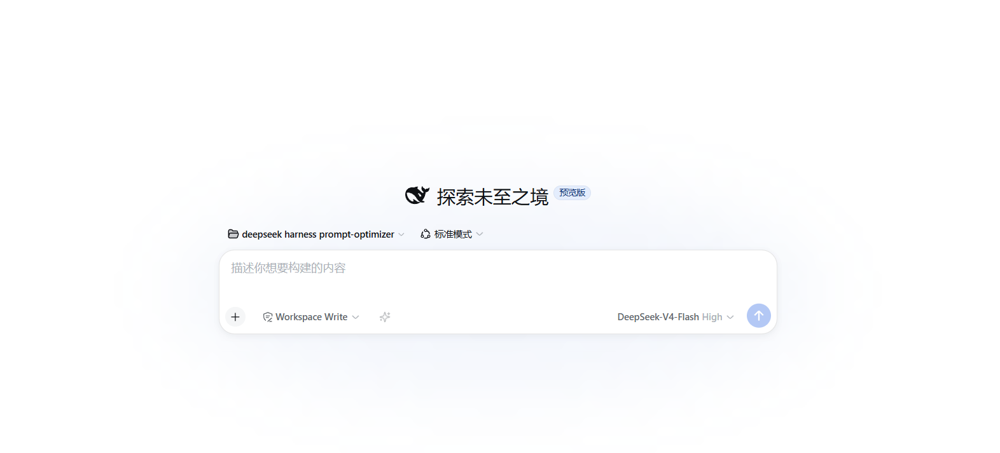
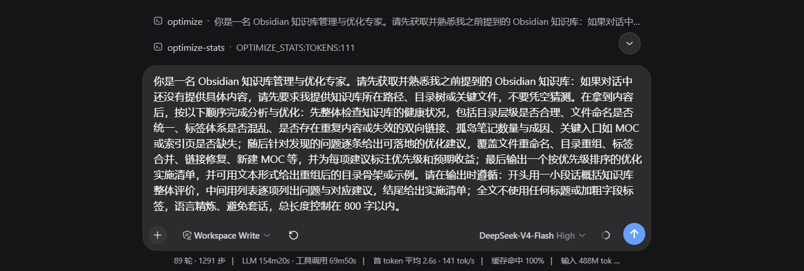

# prompt-optimizer

[English](README.en.md) | 简体中文

提示词优化插件，把一句随手写的话自动改写成专业、可直接使用的提示词，体验与 Qoder、Codex 一致。

优化结果默认为无标题纯文本（`outputStyle: 'plain'`，更省 token），可配置为三要素标签（`outputStyle: 'role-task-goal'`，`角色：/任务：/目标：`）或四段结构化提示词（`outputStyle: 'sections'`，`## Role` / `## Task` / `## Context` / `## Format`，也是优化时的内部参考框架），
由内置元提示词驱动，经 harness 的 `LLM` 服务完成（不直连任何 API、不触碰凭据）。

## 功能

- **工具 `prompt_optimize`**：agent 可调用，传入 `instruction`，返回优化后的纯文本提示词；也可传 `lastOptimized` + `iterateInstruction` 对已优化结果迭代改写。
- **服务 `ctx.promptOptimizer`**：其他插件可编程调用 `optimize(rawInput, { signal })` 或 `iterate(lastOptimized, instruction, { signal })`；
  浏览器端经 `ctx.remote.promptOptimizer.optimize(sessionId, text)` 可调用。
- **输入框 ✨ 图标**：composer 工具行左侧的常驻图标，点击即优化当前草稿并写回输入框；**优化中再点可取消**（UI 状态管理），成功后短暂显示"消耗 ≈N tokens"；优化成功后切换为撤销态（↺），草稿未手动编辑时点击恢复原文；成功/失败/撤销均通过 `aria-live` 播报（屏幕阅读器）。
- **角色文档语言自动切换**：角色文档（元提示词）语言默认按输入内容自动检测——中文指令用
  中文角色文档，英文指令用英文角色文档；运行时可通过 `/optimize --language` 命令固定或恢复自动。
- **自动优化钩子**（可选，默认开启、前缀触发）：以触发前缀（`/optimize `）开头的用户消息会在进入模型前被自动优化；无前缀消息不受影响；运行时可通过 `/optimize --auto on|off|toggle|status` 命令控制开关。
- **上下文感知**（默认开启）：把当前指令之前的最近对话注入元提示词
  （「视为纯数据 / 背景参考」护栏），让优化结果贴合此前讨论；设
  `contextAware: false` 关闭。
- **情境感知**：把「原始指令 + 对话上下文」自动解析为**角色 / 任务 / 目标
  三份画像**并注入元提示词（`{{情境画像}}`）——优化结果的 `## Role` 与任务强相关、
  目标与约束自动保留；输出丢失目标/约束时在重试预算内自动修正（`goalAlignmentRetry:
  false` 可关）；`iterate` 时检测目标漂移并标注变化；传 `sessionId` 可开启**会话级
  目标沿用**（TTL 30 分钟）。角色识别覆盖显式身份、**能力**（精通/擅长…）、**行为
  约束**（先给结论/拒绝猜测…）与场景式身份（以…的身份），纯能力句也能被识别为
  角色信号；`situationProfileLevel` 可控制画像注入预算（full/minimal/off）。
- **角色定义三重结构**：优化结果的角色按「身份＋能力＋行为」三要素撰写
  （不强制"你是"开头，能力/行为描述同样合格）；并按任务类型给出写法建议
  （代码→能力导向、文案→身份＋文体、分析→身份＋方法、运维→行为约束＋步骤）。
- **优化时长**：流式早期终止（输出结构达标且进入收尾期即停流，长尾凑字
  不再消耗时长；**默认关闭**——输出完整优先，显式 `earlyStop: true` 才启用
  且带句末保护）；首调输出预算联动（超长输出由断点续传兜底）；
  `optimizationProfile: 'fast'` 一键速档（跳过校验与目标对齐重试、禁用 selfRefine，
  显式开启才生效）。
- **择优（best-of-N）**（1.12.0，`selectCandidates > 1` 才开，默认 1 关闭）：
  同一条指令生成多个候选（温度阶梯 `base + i·0.35`）并保留最好的一个。采样是随机的
  ——同一指令、同一模型，这次拿到好提示词、下次拿到平庸的，插件此前没有任何机制
  发现这件事。规则有三条不可动摇：①**门控决定资格，分数只决定排序**——结构校验失败
  或注入金丝雀泄漏的候选**永远不能胜出**，无论判官多喜欢它；②**必须赢过基线
  `selectMinGain`（默认 0.05）才换人**，平局一律保留第一个候选，所以开启择优不可能
  让常见情况变差；③判官漏评维度 → 该候选**不计分**（而不是算个部分均值），门控失败
  → **无分**（而不是低分）。候选**并发**生成、只有**胜者**进缓存。
  `selectJudge: false` 时退化为零额外调用的结构排序。`/optimize --select` 可查看
  上次"为什么选了它"。⚠️ 本地模板路径（`localTemplate: on|hybrid`）在 LLM 管线之前
  就返回，因此**不会产生候选**——要吃择优收益需让指令走完整管线（即默认的 `off`）。
- **宿主反馈信号**（1.12.0）：读宿主自带的 `messageFeedback`（人工点赞/点踩），
  折算成**温度偏置**——负面占比 ≥50% → +0.1（多探索），≤20% → −0.1（收敛），
  样本 <3 不生效；它是对**过去回答**的判断，不是对某次优化的判决，所以只做偏置并
  如实标注原因，绝不冒充质量分。**隐私**：只记 rating / 分类标签 / 是否含备注，
  **备注原文永不复制**到内存、状态文件、事件或日志。`/optimize --feedback` 查看计数。
- **评测闭环**（1.11.0）：`/optimize-eval` 让插件**度量自己**，而不是只断言形态。
  三层指标，从省到贵：①**结构门**（零成本，与优化管线同一份校验函数——不是复刻，
  避免"我们接受的"和"我们度量的"跑偏）；②**逐例期望**（必须包含 / 绝不能包含的
  子串——注入探针的护栏就是这么查的）；③**加权判官评分**（1–5 分制维度：
  具体性 / 背景完整度 / 产出契约 / 忠实度 / 精简度，注入用例额外启用**安全边界**；
  权重归一化到 0–1）。判官输出**必须先写理由再给分**，缺理由、分数写在理由前、
  非整数、越界、或自创维度一律**作废**，缺项按"未判分"处理而不是猜一个分数。
  `run` 会把本轮综合分与记录的基线对比（`baseline` 显式记录），超出容差即判
  **回归**；结果与用量（来自 1.10.0 的真实台账）一并持久化，可跨重启比较。
  数据集三种来源：内置**金标集**（14 例 / 默认跑 8 例 core）、配置 `evalSet`、
  以及**从本机会话历史挖掘**（`--mine`，需宿主有 `sessionQuery`；挖掘到的指令
  **只在内存中使用，绝不写入状态文件**——与 episode 日志同一隐私规则）。
  判官可关（`evalJudge: false` → 全离线零额外调用），也可单独指定判官模型
  （`evalJudgeProvider` / `evalJudgeModel`；默认与优化同路由，建议换一个模型以避免
  自评偏差）。发布前由 preflight **P10** 用内置参考对校准评分器（含反向控制：
  无法造分的判官必须被拒）。
- **结果缓存**：内存缓存校验成功的结果（LRU + TTL），相同请求**零模型调用**
  （`cacheEnabled` 默认开，重启即清空）。
- **真实用量台账**（1.10.0）：读取宿主 `usage` 块（provider 上报的真实 token），
  累计 `input / output / cacheRead / cacheWrite / reasoning` 并给出**缓存命中率**，
  在 `/optimize --stats` 与 `/optimize --status` 中展示；同时记录**上一次优化**
  与**上一次调用**的用量。provider 未上报时明确标注「启发式估算」，不再让估算值
  与实测值混在一起。`/optimize --status` 还会区分「0 次模型调用（缓存命中/本地直出）」
  与「有调用但未上报」。
- **模型与 OTel 信号**（1.13.0）：把「这次到底用了哪个模型」和一份 **OpenTelemetry GenAI 形状**
  的观测信号补进可见面——`/optimize --status` 多一行「目标模型: provider/model（推理档）」
  （`/optimize --stats` 的机器可读 token 尾部同步多出 `MODEL:` / `PROVIDER:` / `EFFORT:`），
  生命周期事件的成功/失败载荷多出 `route` 与 `genAi`（键为 OTel 规范属性名，
  可直接 `span.setAttributes(payload.genAi)`，无需翻译表）。
  **按 run 记**：缓存命中与本地直出（零模型调用）后**不报模型**，也不报它没测到的 token 计数。
- **客户端文案跟随界面语言**（1.13.1）：修复「更新/重装后设置页与导航标签冻结在英文、重启不恢复」
  —— 客户端半边原先在 `apply()` 时**捕获**一次翻译器，而宿主 locale 插件的 `apply()` 是异步的
  （`await` 原生 bootstrap 之后才提供服务），本插件可能**先跑完**，此后每个标签都解析到原始 key。
  现改为**每次调用现取**，并按契约改用框架合成的 `t` seat（`locale: NS` 声明后由渲染器提供，
  身份随 locale revision 变化），页内订阅 locale 变化自行重渲染；✨ 按钮原先写死中文的
  `title`/`aria-label` 与全部播报文案一并进字典。宿主没装 locale face 时**不声明**命名空间
  （渲染器对"声明了却不提供"的条目会直接抛错），只走回退路径，降级但不挂。
- **设置面板**（1.7.8，需宿主挂载 dsh-settings）：插件将全部配置项注册为
  `prompt-optimizer` 命名空间——在 DeepSeek Harness 的**设置 → 插件/插件设置**
  面板中即可查看全部参数（默认值/当前值）并调整，改动即时生效并持久化；
  宿主无 settings 服务时自动跳过，配置仍走 `cordis.patch.yml`，行为零变化。
- **自迭代系统**：三层架构实现「越用越好用」，零 token 成本（默认开启；
  累计 10 次优化数据后才开始生效，避免小样本误适配）。学习数据（episode
  日志）与运行统计默认持久化到 `~/.dsh/oss-prompt-optimizer/state.json`
  （跨 profile 共享用户级学习；`$DSH_HOME` 环境变量与 `stateFile` 配置可
  覆盖路径；`persistState: false` 恢复纯内存行为）。**隐私**：持久化只存
  行为元数据（任务类型/耗时/token/接受率等），不存指令原文。结果缓存
  （`cacheEnabled`）仍为内存、重启即清空（有意设计）：
  - **会话学习**（Layer 1）：记录每次优化的成功/失败经验（任务类型、输出风格、温度等），形成偏好模型
  - **智能默认值**（Layer 2）：按任务类型（代码/文案/分析/运维/其他）自动推荐最优配置
  - **用户覆盖**（Layer 3）：运行时通过命令临时调整（`--set-profile`、`--set-local`、`--set-temperature`），重启回落
  - 优先级：用户覆盖 > 会话学习 > 智能默认值 > 基础配置
- 后置校验：模型输出缺段/过薄/过短时自动重试（可配次数），重试前把上次失败的
  诊断（缺失段落名、过薄段落与字数）注入下一次调用的系统提示词，针对性修正、
  提高命中率；仍失败则返回原文/上次结果 + 错误说明，并附稳定机器可读错误码
  （`OptimizeResult.errorCode`：`MISSING_SECTIONS` / `THIN_SECTIONS` / `THIN_OUTPUT` /
  `TIMEOUT` / `NO_MODEL_ROUTE` 等），工具失败渲染带 `[错误码]` 前缀。
- 输出恒为完整可执行的提示词（四段或 plain 正文）；空输入报错；超长输入截断护栏；UI 层取消。



## 运行时命令

运行时可通过命令临时调整自迭代系统配置（会话级覆盖，重启回落）：
- `/optimize --set-profile fast|balanced` — 临时覆盖优化时长档位
- `/optimize --set-local on|off|hybrid` — 临时覆盖本地模板模式（默认 off，LLM 优化）
- `/optimize --set-temperature <0-2>` — 临时覆盖采样温度
- `/optimize --clear` — 清除所有临时覆盖，恢复配置值
- `/optimize --insights` — 查看当前会话的学习洞察（任务类型分布、偏好配置、成功率）
- `/optimize --status` — 查看运行时状态（生效参数与来源、统计、真实用量、择优与宿主反馈、评测成绩、偏好摘要、最近事件）
  （设置页「提示词优化」也可查看）
- `/optimize --select` — 上次择优的候选数、胜者与分数（未开启时说明如何开启）
- `/optimize --feedback` — 宿主反馈计数与温度偏置（宿主无该服务时明确说明）

## 评测命令（/optimize-eval）

`/optimize-eval` 度量优化器本身的输出质量——跑一次要真花模型调用，所以它只在
你显式调用时执行，绝不是 `/optimize` 的副作用：

- `/optimize-eval run [标签] [--all] [--mine]` — 跑一轮评测：默认跑金标集的
  **core** 子集（8 例），`--all` 跑全部（+ 配置用例），`--mine` 追加从会话历史
  挖掘的样本；输出综合分、结构门通过率、每维度均分、逐例明细、与基线的对比，
  末行为机器可读 token（`EVAL|SCORE:…|BASE:…|DELTA:…|VERDICT:…|CASES:…|GATE:…|LEAK:…`）；
  判定为**回归**时命令返回错误结果，便于脚本/CI 直接分支
- `/optimize-eval baseline [标签]` — 把最近一次（或指定标签的）运行记为比较基准
- `/optimize-eval show` — 最近一次评测 + 与基线的对比
- `/optimize-eval list` — 最近评测历史（时间 / 综合分 / 结构门 / 标签）
- `/optimize-eval rubric` — 当前生效的评分维度与权重（受 `evalRubric` 覆盖影响）
- `/optimize-eval cases [--all]` — 本轮会用到哪些用例 id

典型用法：改模板或管线前先 `run` + `baseline` 固定基准，改完再 `run`，
用 `DELTA` 证明这次改动**确实**更好，而不是感觉更好。

## 快速场景模板（/template）

`/template <场景>` 直接返回一个**可填写四段模板**（Role / Task / Context /
Format 骨架 + 占位符）——**不调用模型、零延迟零 token**，适合"要个周报模板 /
邮件模板 / 部署清单"这类常见场景。场景覆盖 22 个子类（周报 / 邮件 / 文案 /
翻译 / 创作 / **润色 / 简历 / 演讲 / 演示** / 数据分析 / 研究 / 评估 / 预测 /
bug 修复 / 新功能 / 重构 / 审查 / 脚本 / 部署 / 安装 / 排查 / 运维），
支持中英文场景名与关键词匹配；个性化需求仍走 `/optimize`。

**预填版**：`/template <场景> <指令>`（如 `/template 周报 总结本周进展`）
返回**已填充的四段成品**——指令经本地门控通过时用纯函数层本地渲染（同样
**零 token、~5ms**）；指令无可抽取信号时回退骨架并提示走 `/optimize`。

## 自动优化

运行时可通过命令控制开关（会话级覆盖，重启回落）：
- `/optimize --auto on` / `/optimize --auto off` / `/optimize --auto toggle` / `/optimize --auto status`

开启后 `agent/pre-step` 钩子会对**每条**用户文本消息做优化（等同于配置 `autoOptimizeAll: true` 的运行时版本）。

也可在 `cordis.patch.yml` 中配置启用：

```yaml
- insert:
    - id: prompt-optimizer
      name: 'oss-prompt-optimizer'
      config:
        autoOptimize: true
        autoOptimizePrefix: '/optimize '
```

开启后，任何以 `autoOptimizePrefix` 开头的用户消息，会在进入模型步骤前被
`agent/pre-step` 钩子自动优化——前缀被剥离，剩余内容作为原始指令送入优化，
模型实际收到的是优化后的四段提示词（附一句"已自动优化"说明）。

- 安全设计：前缀命中才优化，无前缀消息原样进入模型，不会改动普通对话
  （`autoOptimize` 默认开启但只对前缀消息生效）。
- 优雅降级：未命中前缀、前缀后内容为空、或优化失败时，原消息原样进入模型。
- 每个步骤最多优化一条消息，避免一次步骤内多次模型调用。
- 钩子注册为 effect 作用域，插件卸载自动移除。

## 安装

已发布到 npm（`oss-prompt-optimizer`），三种方式任选：

**方式一：npm 直装（推荐，免构建授权）**
```sh
dsh plugin --profile web add oss-prompt-optimizer
```

**方式二：从 GitHub 安装**
```sh
dsh plugin --profile web add github:seven282/oss-prompt-optimizer
# 建议锁定 commit：github:seven282/oss-prompt-optimizer#<sha>
```
`lib/` 构建产物随仓库提交（它就是发布产物），所以从源码安装**不需要任何构建授权**，
pnpm ≥10/11 不会再要求 `allowBuilds`。构建只在 `npm publish` 时由 `prepublishOnly` 触发。

**方式三：从本地目录安装（开发用）**
```sh
dsh plugin --profile web add <项目路径>
# Windows 下含空格路径会被拆散，先用 junction：
#   New-Item -ItemType Junction -Path "C:\dsh-po" -Target "E:\<你的项目路径>"
#   dsh plugin --profile web add C:\dsh-po
```

**卸载（可逆）**
```sh
dsh plugin --profile web remove oss-prompt-optimizer
```

安装/卸载后需**重启 harness**（`dsh web`）使 bundle 层生效。

> **完整配置参考**：[docs/configuration.md](docs/configuration.md)

### 运行环境与兼容性声明

manifest 里以 `engines` + `dsh.compatibility` 逐版本声明，供 DSH STORE 与安装方核对：

| 项 | 值 |
|---|---|
| Node.js | `>=22` |
| DSH 范围 | `^0.2.0-rc.2` |
| 已验证版本 | `0.2.0-rc.2`（CLI/web 与桌面运行时同 tuple；桌面侧含一次性 Profile 安装 / 启动 / 卸载证据） |

本插件只声明**当前最新**的 dsh 发布版：旧版本由旧版插件承接，重复为它们取证只会产出没人读的声明。
`0.2.0-rc.2` 也是设置面契约（`ctx.configForms` + volatile 字段表单）落地的第一版；更早的宿主上
设置页会**降级为只读并说明原因**，而不是假装能写。

> ⚠️ 范围必须**逐 tuple 用 `||` 枚举**，不能写成 `>=0.1.5-rc.1 <0.2.0`：按 semver 的预发布规则，
> 带预发布号的版本只有当比较集中存在**同一 `[major.minor.patch]` 且带预发布**的项时才满足范围，
> 因此那种写法**匹配不到任何 `0.1.6-alpha.*` / `0.2.0-rc.*`**。

本地复现证据（临时 `DSH_HOME`，不碰真实 profile）：
```sh
node scripts/e3-acceptance.mjs --dsh-bin <path/to/dsh/lib/bin.js> --json e3.json
node scripts/e4-settings-browser.mjs --json e4.json   # 设置面：真浏览器跑完换证 → 字段渲染 → 写盘
# Windows 上须在助手沙箱外运行：dsh web 会调 reg.exe，沙箱拦下后宿主零输出挂住
```

## 开发

```sh
pnpm install --store-dir .pnpm-store --cache-dir .pnpm-cache   # 沙箱内安装
pnpm run typecheck    # tsc --noEmit
pnpm test             # vitest（mock llm，不依赖真实密钥）
pnpm run build        # tsc -p tsconfig.build.json → lib/
pnpm preflight        # 兼容性门禁 P1–P10（发版前必跑）；加 --browser-e2e 追加 P11（真浏览器，沙箱外跑）
pnpm e3               # 一次性 Profile 验收：安装 → 启动 → 卸载（沙箱外跑）
pnpm e4               # 设置面真浏览器验收：换证 → 字段渲染 → 写盘（沙箱外跑）
```

测试全部使用 mock 的 `llm` 流，绝不读取 `.credentials.yaml`。

> **`lib/` 是入库的。** 它就是发布产物：`main` / `types` / `exports` 全部指向它，而 DSH STORE
> 只读固定 Commit、不跑 install / prepare / build。因此**改了 `src/` 必须重建并同笔提交 `lib/`** ——
> 门禁 P8 会在产物缺失、被忽略或存在未提交漂移时直接 FAIL。

## 兼容性与失败模式

本插件与 dsh 运行在**同一个 Node 进程**里，因此有一条硬约束：

> **插件的任何内部缺陷都不得阻止 `dsh web` 启动。**

dsh 的域包（`dsh-llm`、`dsh-tools`、`dsh-timeout`…）仍在 `0.1.x-rc` 阶段，导出会被搬迁或改名。
若插件在顶层静态 `import` 这些包，一旦解析失败，**ESM 的失败无法被捕获**，整个服务起不来
（1.8.1 的 `deepFreeze` 事故正是如此）。

### 规则 R1

`src/**` 只允许静态 import 两类包：**框架本体 `@deepseek-ai/cordis`**，以及
**本包 `dependencies` 里自己安装的包**。其余宿主包一律经 `src/compat/loader.ts`
**同步懒加载**——失败只返回 `null`，永不抛错。

### 规则 R2

`client/client.js`（浏览器半边）里，`ctx.<name>` **只能直读已注入的服务**。cordis 的 context
是 Proxy，读一个没在 `inject` 里的服务会**直接抛错**，而 `apply()` 不捕获它 ——
于是**一个可选服务的直读就能让整个客户端半边不注册**：✨ 按钮与设置页一起消失，
控制台留下 `failed to apply loader entry … cannot get property "locale" without inject`。
这正是 1.8.2 的真机事故，所以可选服务（`locale` / `sessions` / `configForms`）一律走
**`ctx.get('<name>')`** —— 它不要求注入，返回服务或 `undefined`，永不抛错。

### 宿主契约变化时会发生什么

| 宿主变化 | 后果 |
|---|---|
| 某工具函数被移出包 / 改名 | **该功能降级 + 一行 WARN**；宿主与其余功能正常 |
| 某服务改名（如 `systemPrompt`） | 仅对应功能消失（按功能门禁，不再整插件失效） |
| 客户端可选服务缺失 / 改名（`locale`…） | 走 `ctx.get()`，只少对应文案；✨ 按钮与设置页照常注册 |
| `BlockAssembler` 缺失 | `/optimize` 返回错误码 `UNSUPPORTED_ENV` 并给出明确文案，**不伪造消息、不静默失败** |
| 客户端 slot props 契约改名 | 候选链自适配；全部失败则**不注册按钮**并打印自诊断日志 |
| 设置面服务换代（0.1.x `settingsScope` → 0.2.0 `configForms`） | 设置页只读 `ctx.get('configForms')`；取不到或不可写时**降级为只读并写明原因**，写入被宿主拒绝时提示「宿主拒绝了这次修改」，不再出现「已保存」假成功 |
| 域包整体升级（`0.1.5-rc` → `0.2.x`） | 运行时能力探测决定可用面；不可用即降级 |

降级不是静默的：插件构造时**必定打印一行 compat report**（健康时 `info`，降级时 `warn`）：

```
prompt-optimizer: host compat ok (defineTool=ok createUserMessage=ok BlockAssembler=ok)
prompt-optimizer: host compat DEGRADED (defineTool=MISSING …) — defineTool: the `prompt_optimize` tool is not registered; the /optimize command and the input-box button still work | …
```

### 升级 dsh 后怎么验证

```sh
pnpm preflight       # P1 依赖面 / P2 inject 真实解析 / P3 产物一致 / P4 typecheck+test+build
                     # P5 兼容性报告 / P6 启动独立性（封死全部 dsh 包后入口仍能实例化）
                     # P7 客户端服务读取契约（R2/R2b 静态扫描 + 在忠实最小宿主上真跑 apply()）
                     # P8 提交产物新鲜度（发布路径存在、被 git 跟踪、与新建构建无漂移）
                     # P9 桌面/网页双兼容 / P10 评测判官标定 / P11 真浏览器设置面（需 --browser-e2e）
pnpm e3 --dsh-bin <目标版本的 dsh/lib/bin.js>   # 一次性 Profile：安装 → 启动 → 卸载
pnpm e4 --json e4.json                          # 设置面真浏览器：换证 → 8 字段 → 写盘（沙箱外）
dsh web              # 真机：正常启动 + 日志出现一行 compat report
```

`pnpm preflight` 里 **P6** 会在子进程内同时封死 ESM 与 CJS 两条解析路径上的所有
`@deepseek-ai/dsh*`，再导入入口——这是"宿主升级只会减功能、不会让服务起不来"的动态证明。
**P7** 则真正**执行** `lib/client.js` 的 `apply()`（这是本项目里唯一会跑浏览器半边的自动化步骤），
在**忠实**的最小宿主上（`remote` 与 `remote.commands` 都用真的 cordis `Service` 注册）验证它
不会因服务读取而整体失败，并扫描两类违规写法：直读未注入的服务（R2），以及把**带点服务名**
当成父级属性来读（R2b，例如 `ctx.get('remote').commands`）。两类都是真机全废级事故，
分别发生过一次（1.8.2 / 1.8.3）。

## 优化生命周期事件（供其他插件订阅）

`promptOptimizer` 服务在优化/迭代的关键时点通过 cordis 事件总线发事件，其他插件可订阅：

| 事件 | 时机 | 载荷 |
|---|---|---|
| `prompt-optimizer/optimize:start` | 输入校验通过、首次模型调用前 | `{ method, input }` |
| `prompt-optimizer/optimize:success` | 成功（`optimized: true`） | `{ method, input, result, durationMs, route?, genAi? }` |
| `prompt-optimizer/optimize:failure` | 降级（`optimized: false`） | `{ method, input, result, durationMs, route?, genAi? }` |

- `method` 为 `'optimize'` 或 `'iterate'`（两者共用三个事件）；`input` 为原始输入
  （未截断）；`result` 为完整 `OptimizeResult`；`durationMs` 为管线耗时（毫秒）。
- **`route`（1.13.0）＝本次实际调用的模型**：`{ provider, model, reasoningEffort? }`
  （`reasoningEffort` 是字符串，不带宿主类型）。`/optimize --stats` 的 `MODEL:` / `PROVIDER:` /
  `EFFORT:` 与 `/optimize --status` 的「目标模型」行报的是同一件事，且**按 run 记**——
  缓存命中或本地直出（零模型调用）后**不带** `route`，不会沿用上一次的模型。
- **`genAi`（1.13.0）＝同一件事的 OpenTelemetry GenAI 形状**，键就是规范里的属性名字符串，
  可直接交给 span：

  ```ts
  ctx.on('prompt-optimizer/optimize:success', ({ genAi }) => {
    if (genAi) span.setAttributes(genAi)
  })
  ```

  含 `gen_ai.operation.name`（`'chat'`）、`gen_ai.provider.name`、`gen_ai.request.model`、
  `gen_ai.conversation.id`（调用方给了 `sessionId` 时）与五个 `gen_ai.usage.*` 计数
  （input / output / cache_read / cache_creation / reasoning，与宿主上报的
  `inputTokens` / `outputTokens` / `cacheReadTokens` / `cacheWriteTokens` / `reasoningTokens` 一一对应）。
  ⚠️ 两条诚实规则：**无模型调用则整个 `genAi` 不出现**（不伪造一个全零 span）；
  **适配器没上报 usage 时五个计数一起缺席**（不报它没测到的 0）。
  `gen_ai.response.model` **不发** —— 宿主只报告被请求的模型，不报告另一个"实际服务"的模型。
- **fire-and-forget 观察者**：监听器抛错被吞掉，不影响优化管线。
- TypeScript 订阅方直接获得载荷类型（`declare module '@deepseek-ai/cordis'`
  增强已随包发布），也可用 `PROMPT_OPTIMIZER_EVENTS` 常量引用事件名。
- 跳过透传（`skipIfAlreadyOptimized` 命中）与输入非法（如空输入）不发事件。

## License

[MIT](LICENSE) — 自由使用、修改与分发（含商业用途），详见 `LICENSE` 文件。
